# Diagrama de Arhitectură Avansată și Specificații de Flux

Acest document oferă o specificație arhitecturală detaliată și de nivel profesional pentru ecosistemul InsideUGAL. Arhitectura sistemului se bazează pe microservicii izolate, structurate pe mai multe straturi (multi-tier), containerizate prin Docker și orchestrate uniform atât în mediul de dezvoltare, cât și în cel de producție.

---

## 1. Topologia Componentelor și Rutarea Bidirecțională în Rețea (Mermaid)

Diagrama de mai jos definește granița explicită a rețelei virtuale Docker. Aceasta ilustrează microserviciile interne, maparea porturilor gazdă și fluxurile de date bidirecționale, cu specificații precise de rutare.

```mermaid
graph LR
    %% Configurare Stiluri Vizuale
    classDef clientLayer fill:#313244,stroke:#74c7ec,stroke-width:2px,color:#cdd6f4;
    classDef gatewayLayer fill:#313244,stroke:#fab387,stroke-width:2px,color:#cdd6f4;
    classDef dataLayer fill:#313244,stroke:#a6e3a1,stroke-width:2px,color:#cdd6f4;
    classDef aiLayer fill:#313244,stroke:#cba6f7,stroke-width:2px,color:#cdd6f4;
    classDef networkBoundary fill:none,stroke:#585b70,stroke-dasharray: 5 5,color:#a6adc8;

    %% Domeniul Client
    User((Student / Browser Client)) <-->|HTTPS / TLS v1.3 <br/> Port 443| VIP[Reverse Proxy Expus]
    
    subgraph insideugal_net [Retea Bridge Izolata Docker]
        %% Modul Frontend
        Frontend[Container Serviciu Frontend <br/> • Runtime: Next.js Node Engine <br/> • Port intern: 3000 <br/> • Rol: Virtual DOM / Dashboard Client]:::clientLayer

        %% Modul Backend Gateway
        Backend[Container API Gateway Backend <br/> • Runtime: FastAPI / Python 3.11 <br/> • Port intern: 8000 <br/> • Rol: Logica de Business & Orchestrare Rute]:::gatewayLayer

        %% Modul Baza de Date
        Supabase[(Container Cluster Baza de Date <br/> • Motor: PostgreSQL 15 <br/> • Port intern: 5432 <br/> • Extensii: Ecosystem Spatial PostGIS)]:::dataLayer

        %% Modul Inteligență Artificială
        LLM[Container Motor AI Cognitiv <br/> • Framework: LangChain / Python <br/> • Port intern: 5000 <br/> • Rol: Pipeline RAG & Analiza Embeddings]:::aiLayer
    end

    %% Maparea Fluxurilor Bidirecționale
    VIP <-->|Mapare porturi: 3000:3000| Frontend
    
    Frontend <-->|1. Token-uri de Autentificare Bearer <br/> 2. Payload-uri JSON prin Cereri REST| Backend
    
    Backend <-->|1. Connection Pool / Interogari SQL Native <br/> 2. Evaluare Context Row Level Security| Supabase
    
    Backend <-->|1. Ingestie Interogari Tokenizate <br/> 2. Injectare Obiect Context Normalizat| LLM
    
    LLM <-->|1. Calcule de Distanta Vectoriala <br/> 2. Fragmente de Context pentru Generare RAG| Supabase

    %% Aplicare Clase Structurale
    class insideugal_net networkBoundary;
```

---

2. Segmentarea pe Straturi și Specificațiile Protocoalelor
A. Stratul Client (Containerul Aplicației Next.js)
Context Runtime Intern: Funcționează pe un strat de bază Node.js securizat (non-root). Acesta expune o arhitectură de dashboard de tip Single-Page Application (SPA) compilată în React.

Mecanica Interfeței Bidirecționale:

Intrare (Inbound): Ascultă evenimentele de interacțiune ale utilizatorului, capturând date de geolocație, prompturi pentru chatbot și acțiuni de navigare.

Ieșire (Outbound): Serializează starea aplicației în payload-uri securizate. Structurează headerele HTTP pentru a include token-uri de securitate de tip Authorization: Bearer <JWT>, generate în urma rutinelor de autentificare de succes din Supabase Auth.

B. Stratul de Logică și Orchestrare (Motorul API Gateway FastAPI)
Context Runtime Intern: Instanță Python asincronă de înaltă performanță (ASGI), care folosește worker-i Uvicorn pentru gestionarea buclei de procesare a cererilor non-blocking.

Mecanica Interfeței Bidirecționale:

Comunicarea cu Frontend-ul: Implementează parametrii de securitate CORS. Interceptează verbele HTTP REST (GET, POST, PATCH, DELETE), validează semnătura token-urilor JWT și parsează variabilele solicitate.

Rutarea către Baza de Date și LLM: Funcționează asincron (task-uri de tip async/await). Mapează operațiunile relaționale către conexiunile bazei de date și declanșează thread-uri paralele pentru a trimite datele de intrare către microserviciul de procesare a limbajului natural (NLP).

C. Stratul de Persistență Spațială și Securitate (Clusterul PostgreSQL)
Context Runtime Intern: Instanță PostgreSQL enterprise, integrată nativ cu motorul topologic PostGIS pentru calcule geometrice și stocare de date custom.

Mecanica Interfeței Bidirecționale:

Aplicarea Securității la Nivel de Rând (RLS): Pentru fiecare fir de conexiune primit, baza de date nu se încrede orbește în puterea administrativă a Backend-ului. În schimb, extrage nativ ID-ul utilizatorului (UID) din contextul tranzacției și elimină automat din interogare rândurile care încalcă politicile de acces.

Evaluarea Spațială: Rulează nativ indexare spațială (structuri de tip R-Tree), returnând instantaneu către backend rezultatele interogărilor de proximitate (ex: calcularea celei mai scurte rute pietonale dintre clădirile UGAL).

D. Stratul de Processare AI Cognitivă (Nodul de Generare RAG)
Context Runtime Intern: Motor Python izolat ce găzduiește instrumente de procesare semantică (LangChain), wrapper-e pentru modele de embeddings și vectori de căutare.

Mecanica Interfeței Bidirecționale:

Bucla de Sinteză a Contextului: Când o întrebare în limbaj natural este trimisă aici din nucleul FastAPI, componenta LLM interoghează baza de date pentru a extrage cunoștințe verificate care se potrivesc din punct de vedere semantic cu întrebarea studentului.

Verificare Strictă (Fără Halucinații): Ingestează fragmentele de context validate (LLM <--> Supabase), le atașează la promptul de sistem al AI-ului, elimină riscul de a inventa răspunsuri și returnează un output de mare acuratețe către API-ul central.
